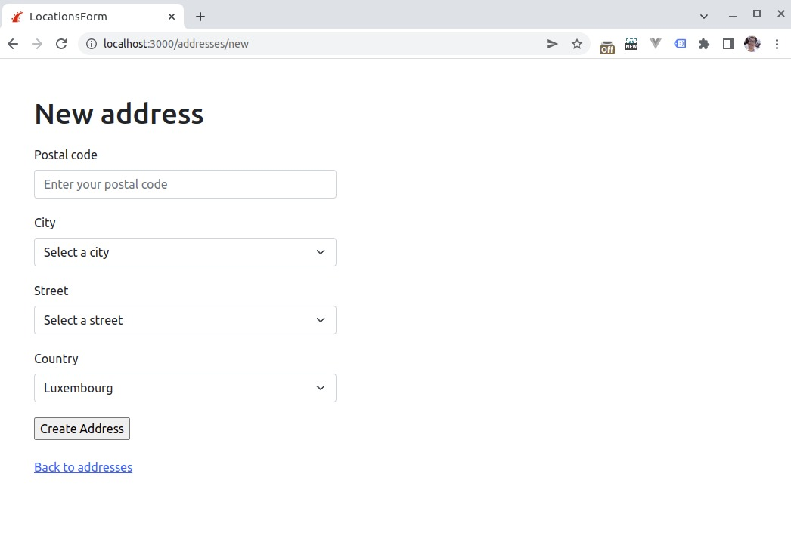

# Locations Form

Simple locations form built with Rails 7 and Stimulus.

The fields are pre-populated depending on the data the user enters (postal code, city...).

The Luxembourg addresses were extracted from [https://data.public.lu/](https://data.public.lu/en/datasets/registre-national-des-localites-et-des-rues/)



## Requirements

- Ruby 3.0.1
- PostgreSQL (versions 9.3 and up are supported)

## Running the app

1. Install the dependencies:

```
bundle install
```

2. Create the database and run the migrations:

```
rails db:setup
```

3. Populate locations table:

```
rails locations:import
```

4. Run the server

```
rails s
```
